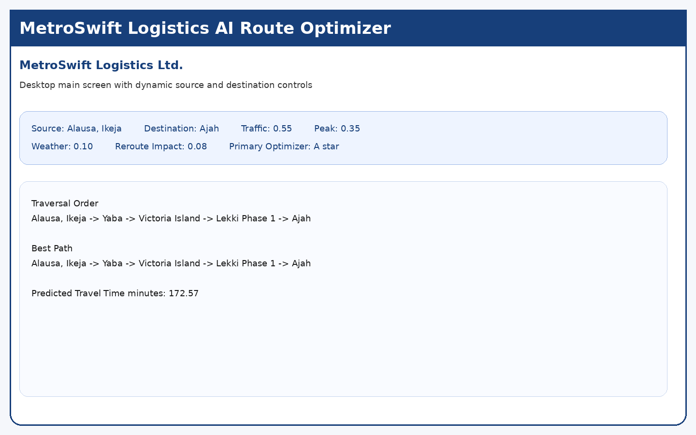
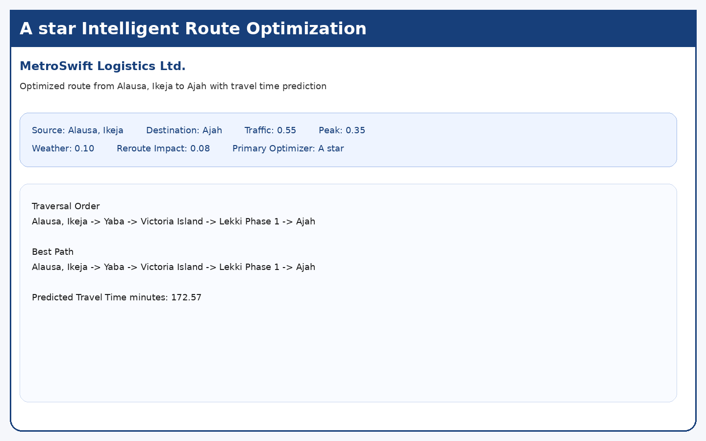
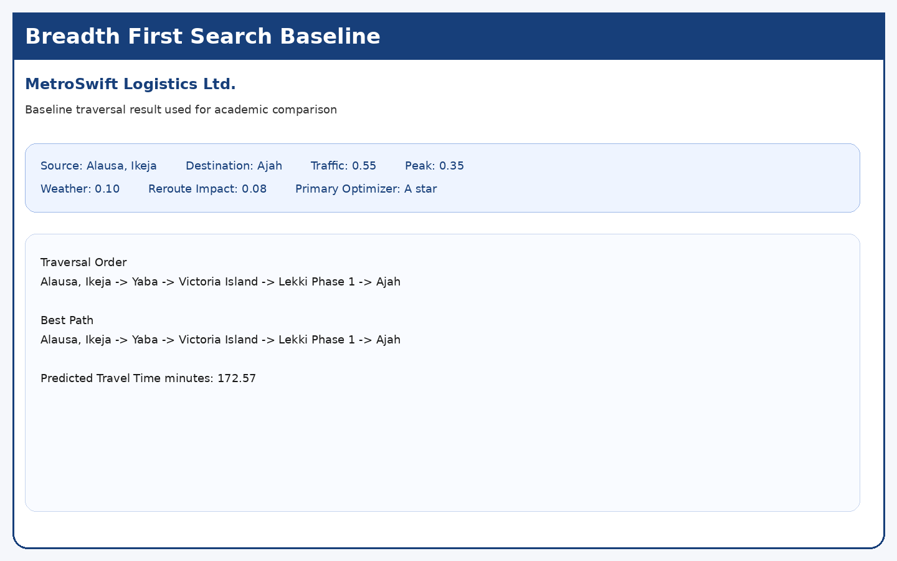
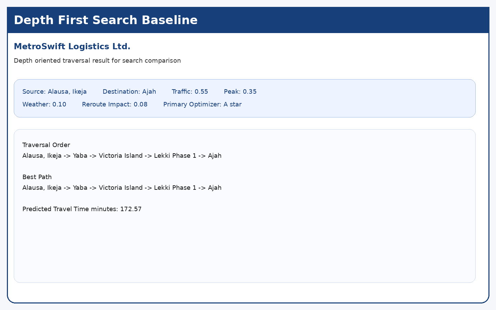
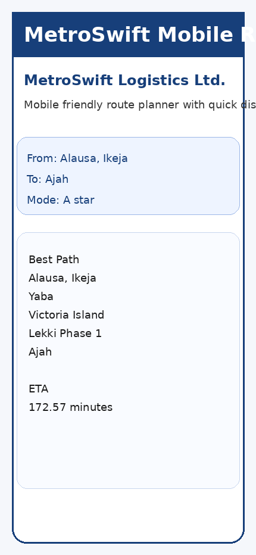
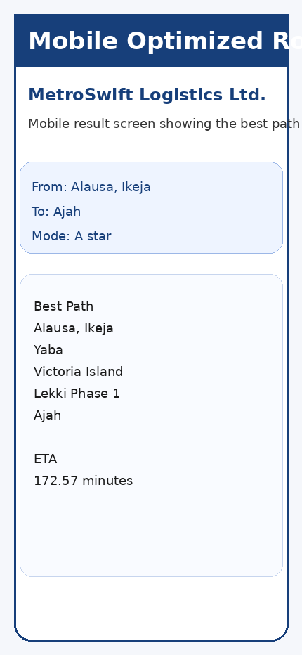

# MIT807 Group 7 Final Submission

## Cover Page
**Project Title**
MetroSwift Logistics Ltd. Lagos Route Optimization System

**Course**
MIT807

**Departmental Submission**
Lecturer Ready Final Submission Package

**Project Theme**
AI Based Route Optimization System for Urban Logistics in Lagos Using Predictive Travel Time Modelling and A star Search Strategy

**Primary Company Case**
MetroSwift Logistics Ltd.

**Primary Depot**
Alausa, Ikeja, Lagos

## Team Members
| S/N | Name | Matric Number |
|---|---|---|
| 1 | Sofolabo Ebunoluwa Godiya | 249074016 |
| 2 | Adenuga Oluwapelumi Ayomikun | 249074107 |
| 3 | Kazeem Oladehinde Olanrewaju | 249074082 |
| 4 | Adebayo Tosin Esther | 249074192 |
| 5 | Badiru Ismail Kofoworola | 080201050 |
| 6 | Ekundayo Mathew Mayowa | 140408037 |
| 7 | Unuigboje Aisagbonhi Ohimai | 840404062 |
| 8 | Odemakin Victoria Ifeoluwa | 249074010 |
| 9 | Priscilla Oluchukwu Ikeri | 130310014 |
| 10 | Russele Eduje Sharon | 249074275 |

## Submission Summary
This final package contains a lecturer ready desktop application, a mobile Progressive Web App style prototype, screenshots, installation guidance, technical documentation, and a clean final archive.

## What Is Included
### Desktop Version
The desktop version is the main implementation. It is built with Python and Tkinter and supports route planning, rerouting, and return to base operations using predictive travel time and A star search.

### Mobile Version
The mobile version is a lightweight Progressive Web App style prototype located in `mobile_app`. It can be opened directly in a browser and has a touch friendly layout suitable for phone demonstration.

### Standalone Desktop Build Guidance
A packaged standalone build folder is included in the project as build guidance for lecturer demonstration and deployment preparation.

## Core AI Methodology
### Predictive Travel Time Layer
The system transforms static distance values into estimated operational travel time using traffic, peak period pressure, weather impact, and reroute effect.

### A star Search
A star is the primary intelligent search method because it combines actual path cost with a heuristic estimate of the remaining route.

### BFS and DFS
BFS and DFS are retained as academic comparison baselines.

## Lecturer Installation Instructions
### Option A: Run From Source
1. Install Python 3.10 or newer.
2. Open a terminal inside `group7_logistics_ai_framework`.
3. Run `python tests/test_search.py`.
4. Run `python main.py`.

### Option B: Use the Desktop Build Folder
Open the packaged desktop build folder and run the generated executable if available for your platform. If the executable is not provided on the lecturer machine, the source version above remains the primary reliable version.

### Mobile PWA Style Prototype
Open `mobile_app/index.html` in a browser. For mobile use, copy the `mobile_app` folder to a phone or serve it from a local computer. The prototype also includes a web app manifest and a service worker file.

## Screenshots
### Desktop Main Screen


### Desktop A star Result


### Desktop BFS Result


### Desktop DFS Result


### Mobile Home Screen


### Mobile Result Screen


## Project Structure
```text
group7_logistics_ai_framework/
├── app/
├── assets/
├── desktop_build/
├── mobile_app/
├── tests/
├── main.py
├── README.md
└── MetroSwift_Technical_Report.md
```

## Lecturer Notes
The desktop application is the main assessed implementation. The mobile version is a polished demonstration companion. The included screenshots and report are designed to support presentation, marking, and quick review.
